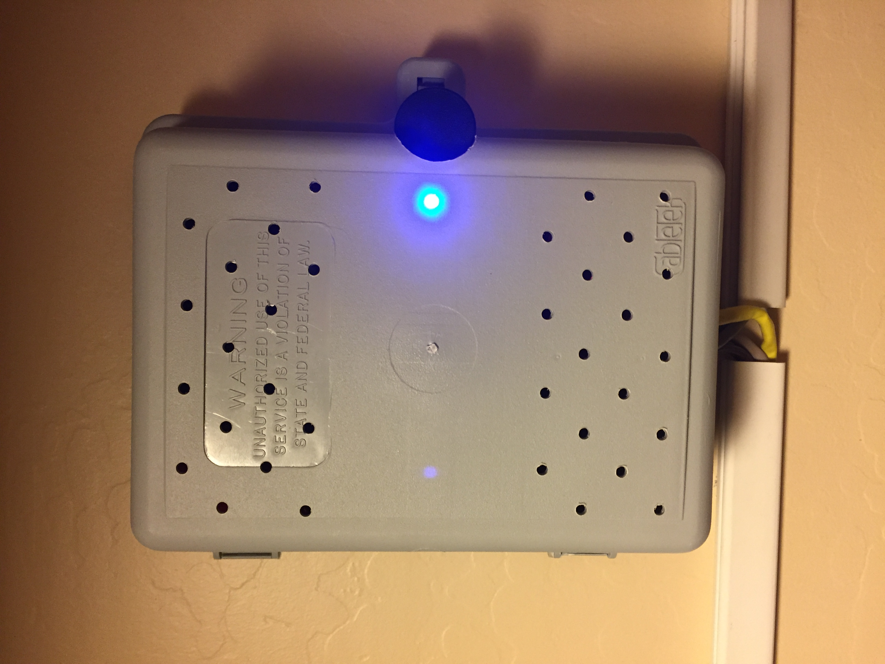
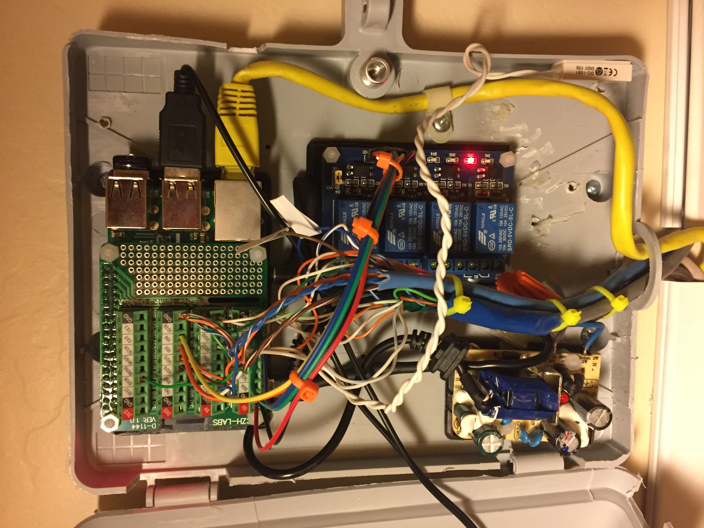
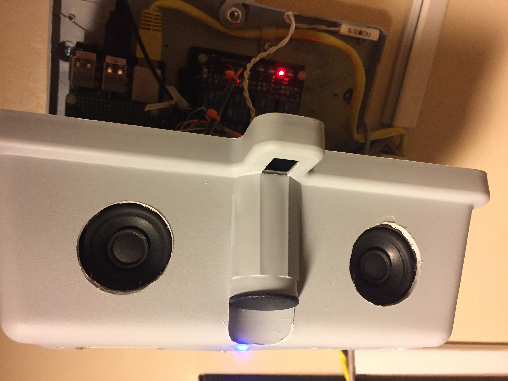
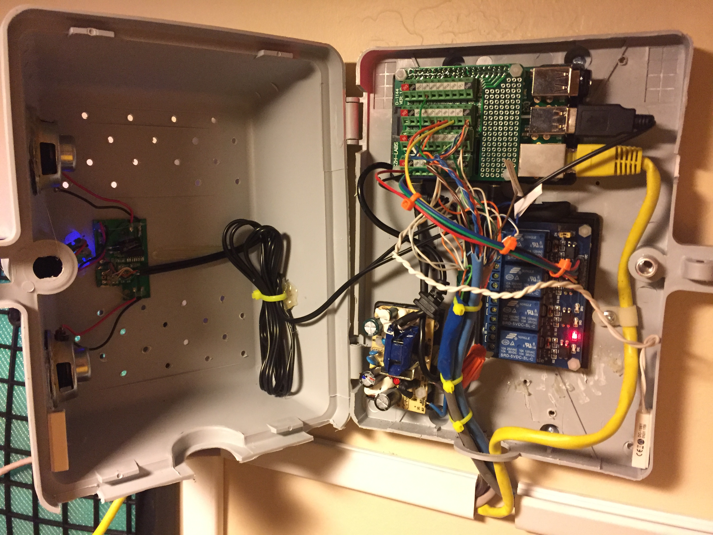

# Meep  

Meep is a configurable alarm program based around a Raspberry Pi setup with existing sensors.  If you have a house wired for an alarm system, this makes a very cost-effective solution without having to subscribe to a service.

This is the python/mongo back-end of the alarm system.  Technically, it's functional as-is;  config files can be used to manage the system and the output will show status alerts.  However, check out [Meep-frontend](https://github.com/scooterhanson/Meep-frontend) for a PHP web console (designed for mobile use) that adds a lot of control and visibility to the system.

## Installation
### Dependencies
- Python 2.7 (anyone is welcome to help with python 3 support)
- MongoDB (create a database named 'alarm' and configure `system.json` for the host and port)
- ALSA tools
-- aplay (for playing audio alerts)
-- amixer (for setting system volume)
- RPi.GPIO

## Running
Meep can be started straight from the command line (`` $ python /home/pi/bin/meep/meep.py``), or using the `watchdog.sh` script which makes sure the process is running.  Running `watchdog.sh` as a cron job makes for a good solution.

## Notifications
Meep supports different types of alerts, configured to multiple sensors connected to the Pi's GPIO pins.

### Audio
Configure the system to *beep* on door and/or motion events.  Each sensor can be configured to use a custom alert sound.

The `meep/audio` directory contains several choices of sounds, including generated speech alerts for common sensors.  All generated speech alerts were created at [From Text To Speech](http://www.fromtexttospeech.com/), and saved as .wav files (or converted from .mp3 to .wav using something like [Audacity](https://www.audacityteam.org/)).

### SMS
If you have an account with an online SMS service (such as [Twilio](https://www.twilio.com/)), the system can send texts to a specified number.  Again, this can be configured differently for each sensor and controlled globally for the system.

Configuring Twilio integration can be done in `notifiers.json` using your account number, token, source phone number, and destination phone number:

    "sms": {
      "enabled": true,
      "client": "TwilioRestClient",
      "account": "ABCDEFGHI123456789",
      "token": "987654321IHGFEDCBA",
      "from_num": "2025551212",
      "to_num": "2125552424"
    },

### Siren
The siren feature is still a little up in the air...  The plan is to trigger this off of a relay, using a 12V siren and strobe light.

## Database Logging
### MongoDB
The default database connection string is assuming mongo is running on localhost:27017, and is at a mount point of */media/alarm_db*. (The mount point is of interest because I have this pain point with mongo being mounted on a thumb drive.  It has had a habit in the past of locking up, so I have included `fix_mongo.sh` in this repo that removes the lock and keeps things ticking -- also managed by the `watchdog.sh` script).

These are configurable in `system.json`.

The database name is 'alarm'.

## Sensor Configuration
`sensors.json` contains a list of all sensors configured for the alarm.  Each record specifies the GPIO pin, what types of events to track and alert, and the audio file associated.

    "sensor1": {
      "sensorid": "1",
      "name": "FRONT DOOR",
      "pin": "23",
      "type": "door",
      "track_open": "true",
      "track_close": "true",
      "notify_open": "true",
      "alert_open": "true",
      "notify_close": "false",
      "alert_close": "false",
      "alert_sound": "alert-front_door.wav"
    }, ...

## Web Admin UI
See [Meep-frontend](https://github.com/scooterhanson/Meep-frontend) for a PHP application to administer the alarm.

## Example Hardware Setup

This example has Meep running on a Raspberry Pi model 3, with a [screw terminal breakout module](https://www.amazon.com/Electronics-Salon-Terminal-Breakout-Module-Raspberry/dp/B01M27459S/ref=sr_1_1_sspa?ie=UTF8&qid=1516498810&sr=8-1-spons&keywords=raspberry%20pi%20screw%20terminal&psc=1) which makes the wiring much easier.  One of the wired sensors is attached to the base and lid of the panel box to sense when the panel has been opened.

The relay shown is a [JBTek 4 switch relay](https://www.amazon.com/gp/product/B00KTEN3TM/ref=oh_aui_search_detailpage?ie=UTF8&psc=1) (most active-low relays will do just fine) with direct control pins, connected to the Pi's 5v and GND pins.  The inputs (1-4) are connected to GPIO screw terminals on the breakout module (see [Meep-frontend](https://github.com/scooterhanson/Meep-frontend) for details on what they do).

The 2A power supply has been taken apart and mounted directly into the box, with the 110 input soldered to the board, in order to maximize space.

The lid of the box has the internals from a USB-powered (driven from the Pi), line-in speaker.

A 1GB thumb drive is attached to the Pi as the mount point for the MongoDB database.

